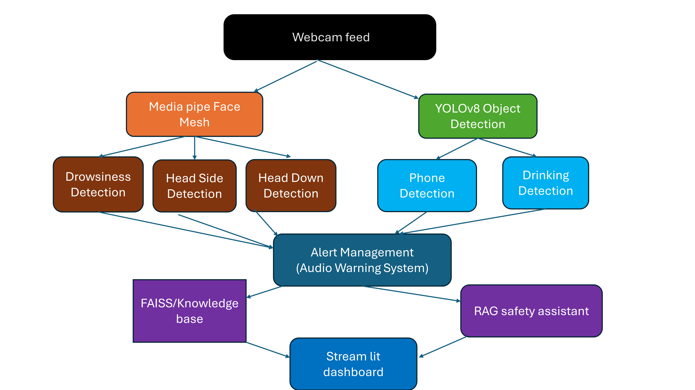

# 🚗 AI Driver Monitoring System

## 📌 Overview

AI Driver Monitoring System is a real-time intelligent safety application developed using Computer Vision, Deep Learning, and Retrieval-Augmented Generation (RAG). The system continuously monitors driver behavior through a webcam and detects unsafe driving conditions such as drowsiness, mobile phone usage, drinking while driving, head-down posture, and driver distraction.

The application provides real-time alerts, driver safety scoring, and AI-powered safety guidance to promote safer driving habits and reduce accident risks.

---

## ✨ Key Features

✅ Drowsiness Detection using Eye Aspect Ratio (EAR)

✅ Mobile Phone Usage Detection using YOLOv8

✅ Drinking Detection using YOLOv8

✅ Head Side Distraction Detection using MediaPipe Face Mesh

✅ Head Down Posture Detection

✅ Real-Time Audio Alert System

✅ Driver Safety Score Dashboard

✅ RAG-Based Safety Assistant

✅ Modern Interactive Streamlit Interface

---

## 🛠️ Technology Stack

### Programming Language

* Python

### Computer Vision & Deep Learning

* OpenCV
* YOLOv8
* MediaPipe Face Mesh
* PyTorch

### Generative AI & Retrieval

* Retrieval-Augmented Generation (RAG)
* FAISS
* Sentence Transformers

### Frontend Dashboard

* Streamlit

### Supporting Libraries

* NumPy
* Pandas

### Version Control

* Git
* GitHub

---

## 🏗️ System Architecture



---

## 📸 Project Screenshots

### Dashboard Interface


### Drowsiness Detection


### Mobile Phone Detection


### Driver Distraction Detection


---

## 🔄 Workflow

1. Webcam captures live video frames.
2. YOLOv8 detects mobile phone usage and drinking behavior.
3. MediaPipe Face Mesh extracts facial landmarks.
4. Eye Aspect Ratio (EAR) is calculated for drowsiness detection.
5. Head orientation analysis detects distraction and head-down posture.
6. Driver safety score is updated dynamically.
7. Audio alerts are triggered for unsafe behavior.
8. RAG module retrieves contextual safety guidance.
9. Streamlit dashboard displays real-time monitoring results.

---

## 📁 Project Structure

```text
AI-Driver-Monitoring-System/
│
├── Alerts/
│   └── alarm.py
│
├── Detection/
│   ├── Drowsiness.py
│   ├── ear.py
│   └── object_detection.py
│
├── RAG_system/
│   ├── knowledge_base.txt
│   └── rag.py
│
├── screenshots/
│   ├── dashboard.png
│   ├── drowsiness.png
│   ├── phone_detection.png
│   └── distraction.png
│
├── app.py
├── requirements.txt
├── Architecture.png
└── README.md
```

## 🚀 Installation

```bash
git clone https://github.com/Neilshijilkumar/AI-Driver-Monitoring-System.git

cd AI-Driver-Monitoring-System

pip install -r requirements.txt

streamlit run app.py
```

---

## 🎯 Learning Outcomes

Through this project, I gained practical experience in:

* Real-Time Computer Vision Applications
* Object Detection using YOLOv8
* Facial Landmark Analysis using MediaPipe
* Deep Learning and AI System Development
* Retrieval-Augmented Generation (RAG)
* Vector Similarity Search using FAISS
* Interactive Dashboard Development with Streamlit
* Git and GitHub Version Control

---

## 🔮 Future Enhancements

* Seatbelt Detection
* Driver Identity Verification
* Emotion Recognition
* GPS-Based Driver Analytics
* Cloud Deployment
* Advanced Driver Behavior Analysis

---

## 👨‍💻 Author

**Neil Shijil Kumar**

GitHub: https://github.com/Neilshijilkumar

LinkedIn: [Add Your LinkedIn Profile]
